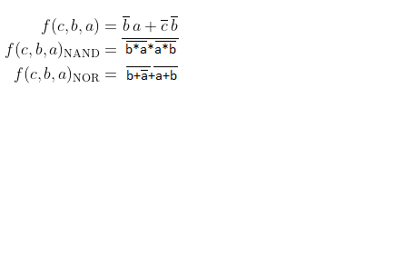

## 1. Git

Odkaz na [Github](https://github.com/DavidHala123/Digital-Electronics-1)

## Rovnice a tabulky
**Equatioions**



**Table**

| **a** | **b** |**c** | **f(a,b,c)** |**f(a,b,c)NAND** |**f(a,b,c)NOR** |
| :-: | :-: | :-: | :-: | :-: | :-: |
| 0 | 0 | 0 | 1 | 1 | 1 |
| 0 | 0 | 1 | 1 | 1 | 1 |
| 0 | 1 | 0 | 0 | 0 | 0 |
| 0 | 1 | 1 | 0 | 0 | 0 |
| 1 | 0 | 0 | 0 | 0 | 0 |
| 1 | 0 | 1 | 1 | 1 | 1 |
| 1 | 1 | 0 | 0 | 0 | 0 |
| 1 | 1 | 1 | 0 | 0 | 0 |

**Code**

```vhdl
architecture dataflow of gates is 
begin 
	 f_o <= ((not b_i) and a_i) or ((not c_i) and (not b_i));
     fnand_o <= not ((not ((not b_i) and a_i)) and (not((not c_i) and (not b_i))));
     fnor_o <= not(b_i or (not a_i)) or (not (c_i or b_i));
     
end architecture dataflow;
```


