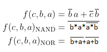

## 1. Git

Odkaz na [Github](https://github.com/DavidHala123/Digital-Electronics-1)

## Rovnice a tabulky
**Rovnice**

| **a** | **b** |**c** | **f(a,b,c)** |**f(a,b,c)NAND** |**f(a,b,c)NOR** |
| :-: | :-: | :-: | :-: | :-: | :-: |
| 0 | 0 | 0 | 1 | 1 | 1 |
| 0 | 0 | 1 | 1 | 1 | 1 |
| 0 | 1 | 0 | 0 | 0 | 0 |
| 0 | 1 | 1 | 0 | 0 | 0 |
| 1 | 0 | 0 | 0 | 0 | 0 |
| 1 | 0 | 1 | 1 | 1 | 1 |
| 1 | 1 | 0 | 0 | 0 | 0 |
| 1 | 1 | 1 | 0 | 0 | 0 |

