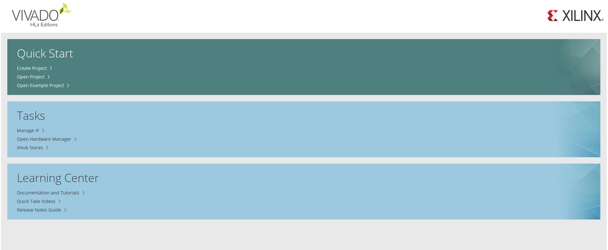
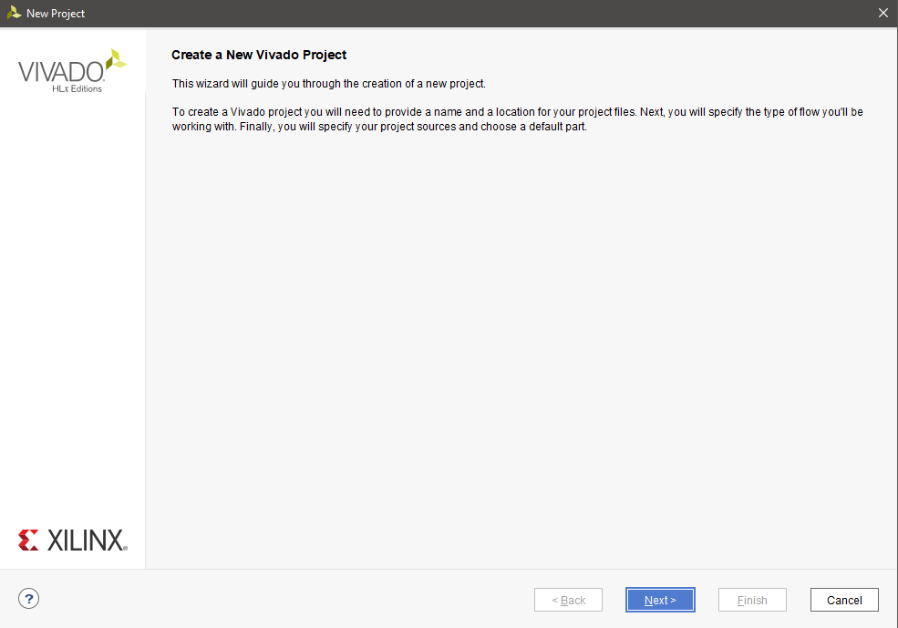
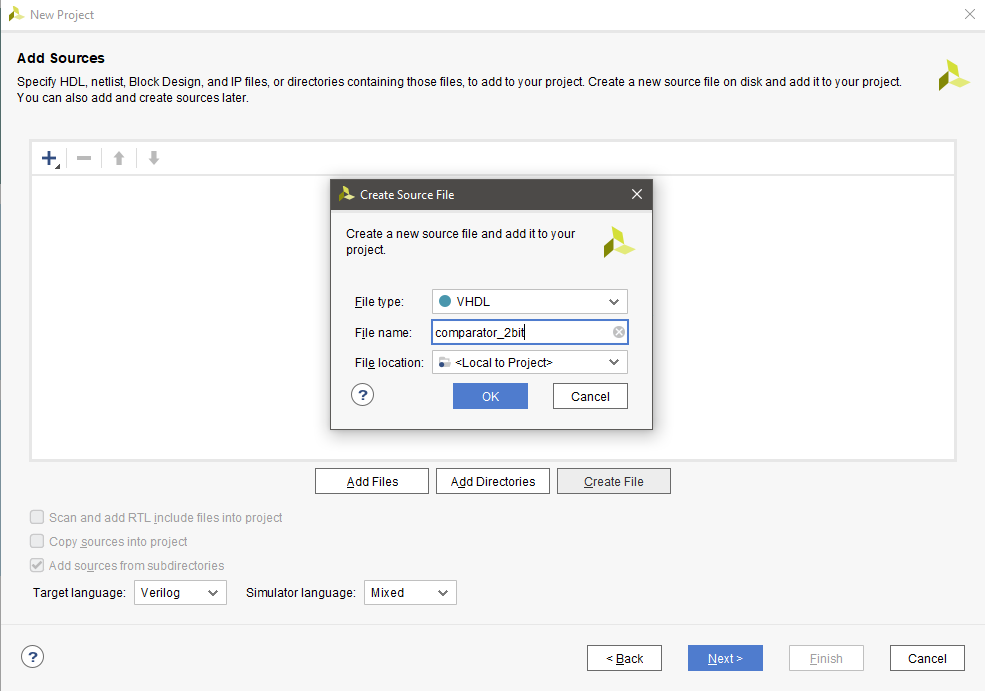
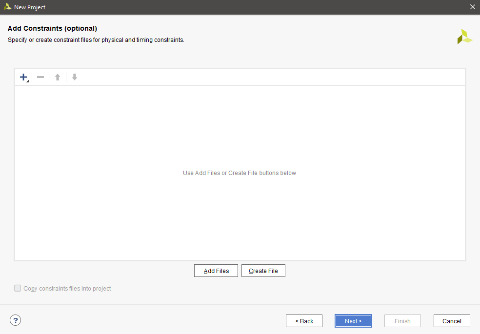
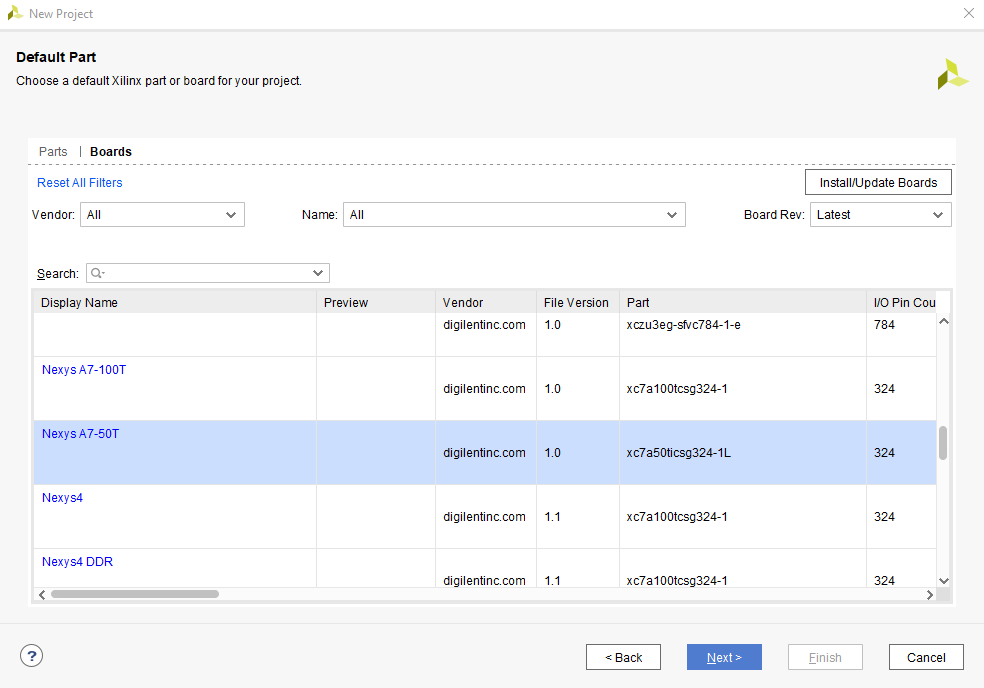
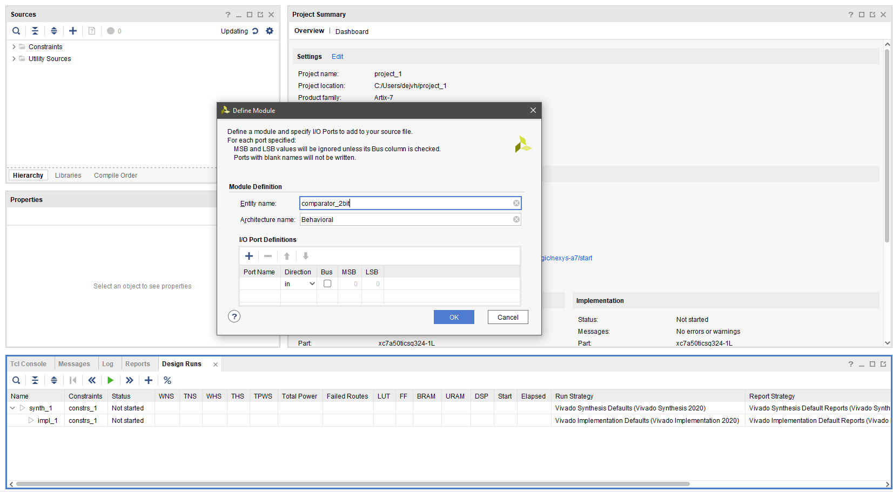
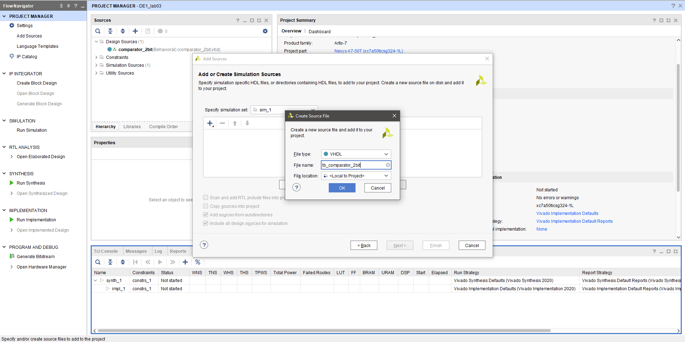

## 1.Table with connections

| **LED** | **Connection** | **Switch** | **Connection** | 
| :-: | :-: | :-: | :-: |
| LED0 | H17 | SW0 | J15 |
| LED1 | K15 | SW1 | L16 |
| LED2 | J13 | SW2 | M13 |
| LED3 | N14 | SW3 | R15 |
| LED4 | R18 | SW4 | R17 |
| LED5 | V17 | SW5 | T18 |
| LED6 | U17 | SW6 | U18 |
| LED7 | U16 | SW7 | R13 |
| LED8 | V16 | SW8 | T8 |
| LED9 | T15 | SW9 | U8 |
| LED10 | U14 | SW10 | R16 |
| LED11 | T16 | SW11 | T13 |
| LED12 | V15 | SW12 | H6 |
| LED13 | V14 | SW13 | U12 |
| LED14 | V12 | SW14 | U11 |
| LED15 | V11 | SW15 | V10 |

## 2. Code

**mux_2bit_4to1.vhdl**

```vhdl
library IEEE;
use IEEE.STD_LOGIC_1164.ALL;


entity mux_2bit_4to1 is
    port (
          a_i   : in std_logic_vector(2 - 1 downto 0);
          b_i   : in std_logic_vector(2 - 1 downto 0);
          c_i   : in std_logic_vector(2 - 1 downto 0);
          d_i   : in std_logic_vector(2 - 1 downto 0);
          sel_i : in std_logic_vector(2 - 1 downto 0);
          
          f_o   : out std_logic_vector(2 - 1 downto 0)
         );
end entity mux_2bit_4to1;

architecture Behavioral of mux_2bit_4to1 is
begin

    f_o <= a_i when (sel_i = "00") else
           b_i when (sel_i = "01") else
           c_i when (sel_i = "10") else
           d_i;

end Behavioral;
```

**tb_mux_2bit_4to1.vhdl**

```vhdl
library ieee;
use ieee.std_logic_1164.all;


entity tb_mux_2bit_4to1 is

end entity tb_mux_2bit_4to1;

architecture testbench of tb_mux_2bit_4to1 is

    signal s_a       : std_logic_vector(2 - 1 downto 0);
    signal s_b       : std_logic_vector(2 - 1 downto 0);
    signal s_c       : std_logic_vector(2 - 1 downto 0);
    signal s_d       : std_logic_vector(2 - 1 downto 0);
    signal s_sel       : std_logic_vector(2 - 1 downto 0);
    
    signal s_f       : std_logic_vector(2 - 1 downto 0);

begin

    uut_mux_2bit_4to1 : entity work.mux_2bit_4to1
        port map(
            a_i           => s_a,
            b_i           => s_b,
            c_i           => s_c,
            d_i           => s_d,
            sel_i           => s_sel,
            f_o           => s_f
        );


    p_stimulus : process
    begin
        -- Report a note at the begining of stimulus process
        report "Stimulus process started" severity note;

        s_d <= "11"; s_c <= "10"; s_b <= "01"; s_a <= "00"; 
        s_sel <= "00"; 
        wait for 250 ns;
        
        s_d <= "11"; s_c <= "10"; s_b <= "01"; s_a <= "00"; 
        s_sel <= "01"; 
        wait for 250 ns;
        
        s_d <= "11"; s_c <= "10"; s_b <= "01"; s_a <= "00"; 
        s_sel <= "10"; 
        wait for 250 ns;
        
        s_d <= "11"; s_c <= "10"; s_b <= "01"; s_a <= "00"; 
        s_sel <= "11"; 
        wait for 250 ns;
        
        

               
        report "Stimulus process finished" severity note;
        wait;
    end process p_stimulus;

end architecture testbench;

```


**Simulation**


## 3. Vivado tutorial

**New project**
1. Create new project (Quick start -> Create Project)



2. Click "Next"



3. Name your project and select folder to save your project in


4. Check "RTL Project"


5. Create Source file



6. Click "Next"



7. Select "Boards" in the upper part of the window. Then select your board



8. Click "Finish"


9. Click "Ok"



**Add testbench file**

1. File -> Add Sources...


2. Check "Add or create simulation sources"


3. Select your File type and name



4. Done


